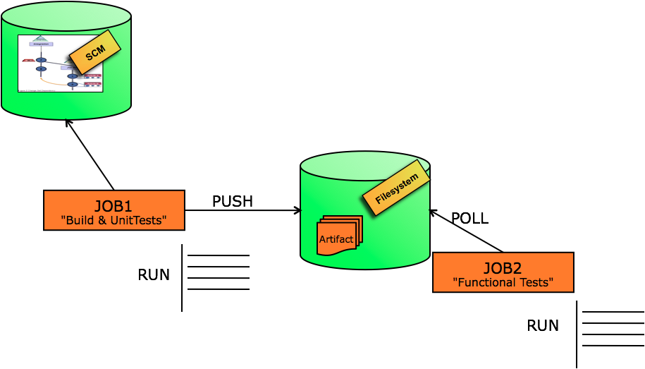
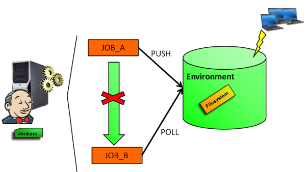

# FSTrigger Plugin for Jenkins

FSTrigger provides polling mechanisms to monitor a file system and
trigger a build if a file or a set of files have changed.

# Features

The plug-in makes it possible to monitor changes of a file or a set of
files in a folder.

Note: The plug-in uses only persistence in memory. There is no impact on
the Jenkins infrastructure (no new files created).  
This plugin provides a polling typology among the [XTrigger
Plugin](https://wiki.jenkins.io/display/JENKINS/XTrigger+Plugin).

## 1) Polling a set of files in a folder

For the first use case, we trigger a build if the list of files has
changed between 2 pollings:  
A build is triggered in the following situations:

-   there are more or fewer files
-   the last modified date of at least one file has changed
-   the content of at least one file has changed

## 2) Polling a file in a folder

For the second use case, we monitor a file from a path.  
The file path can be provided either explicitly or with a GLOB.

A build is triggered in the following situations:

-   The file exists and it didn't exist in the previous polling
-   The file no longer exists whereas it existed in the previous polling
-   The last modification date of the file has changed compared to the
    previous polling
-   The content of the file has changed

For the latest choice, the content file detection can be:

-   the full content in a file (whatever the file type)
-   the modification of values from XPath expressions in an XML file
-   the modification of the structure or the content in a JAR or in ZIP
    file
-   the modification of the structure or the content in a TAR file.
-   the modification of a property (or all properties) in a properties
    file
-   the modification of an attribute (or all attributes) in the
    MANIFEST.NF of a JAR file
-   the modification of an attribute (or all attributes) in a source
    MANIFEST.NF
-   the presence of a pattern in a text file (such as a log file)

# Some use cases

**1. Scheduling a build if a specified file is found in a folder and was
not present in the previous build**

**2. Scheduling a build if the last modification date of a file has
changed compared to the last modification file date captured in the
previous polling**

**3. Avoiding explicit jobs dependencies (with upstream/downstream
mechanisms)**

-   A first job 'jobA' polls a SCM tool and schedules a build if there
    is at least one change.  
    The build instantiates a build process, produces artifacts
    (binaries, text output, ...) and deploys these artifacts in a target
    filesystem.
-   A second job 'jobB' checks the existance of the new artifacts in the
    target filesystem. If there is a change, 'jobB' is scheduled.  
    'jobB' may provide packaging steps, testing steps or other steps of
    a pipeline.

Both jobs are independents and listen external events.

# Other similar plugins

If you want just to know if a set of files exists and display the
number of files found, you can use [Files Found
Trigger](https://plugins.jenkins.io/files-found-trigger/)
plugin.

# Known Limitations

The current code is written in Java and it is not very optimized. For
example, we can't get similar performance as with Python. Therefore, we
recommend to not use FSTrigger plugin when you want to poll a directory
with a large set of files.

The current code does not work with Pipeline projects (  
[JENKINS-48239](https://issues.jenkins-ci.org/browse/JENKINS-48239)).

# Version History
Please refer to the [changelog](CHANGELOG.md).
